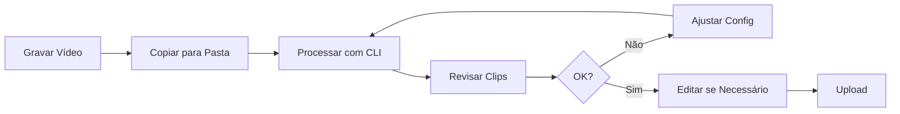

# Exemplos Práticos

Esta página apresenta exemplos práticos de como usar o Video Clips Automation para diferentes situações.

---

## Exemplos por Plataforma

### YouTube

#### Criar Clips de Vídeo Aula

Você gravou uma aula de 30 minutos com 3 tópicos:

```bash
python -m src.cli.commands process aula_30min.mp4 \
  --visual-cut \
  --sensitivity medium \
  --generate-subtitles
```

**Resultado:** 3 clips (um para cada tópico)

#### Highlight de Vídeo Longo

```bash
python -m src.cli.commands process video_longo.mp4 \
  --visual-cut \
  --sensitivity high \
  --remove-silence \
  --silence-db -40 \
  --generate-subtitles
```

### TikTok/Reels

#### Clips com Duração Mínima

Para TikTok/Reels, você pode definir uma duração mínima para evitar clips muito curtos:

```bash
python -m src.cli.commands process video.mp4 \
  --visual-cut \
  --sensitivity high \
  --min-clip-duration 4
```

**Resultado:** Only serão gerados clips com **mais de** 4 segundos.

#### Moments para Redes Sociais

```bash
python -m src.cli.commands process gravar.mp4 \
  --visual-cut \
  --sensitivity high \
  --remove-silence \
  --silence-db -35 \
  --burn-subtitles \
  --output quality high
```

**Dicas:**
- Use sensibilidade alta para mais clips
- Queime as legendas para não precisar adicionar depois
- Use alta qualidade

### Podcasts

#### Processar Entrevista

```bash
python -m src.cli.commands process podcast.mp4 \
  --visual-cut \
  --sensitivity medium \
  --remove-silence \
  --silence-db -45 \
  --normalize-audio \
  --generate-subtitles
```

**Por quê?**
- Remover pausas de "hmm..."
- Normalizar volume
- Gerar legendas

### Gaming

#### Highlights de Gameplay

```bash
python -m src.cli.commands process gameplay.mp4 \
  --visual-cut \
  --sensitivity high \
  --sample-rate 3
```

**ConfiguraçõesIdeais:**
- Alta sensibilidade (mudanças claras)
- Sample rate menor (mais precisão)

---

## Exemplos por Tipo de Conteúdo

### Tutorials

```bash
# Tutorial com múltiplas seções
python -m src.cli.commands process tutorial.mp4 \
  --visual-cut \
  --sensitivity medium \
  --remove-silence \
  --silence-db -40 \
  --silence-duration 0.8
```

**ConfiguraçõesIdeais:**
- Sensibilidade média
- Silêncio com threshold -40dB
- Duração mínima 0.8s

### Entrevistas

```bash
# Entrevista com perguntas e respostas
python -m src.cli.commands process entrevista.mp4 \
  --visual-cut \
  --sensitivity low \
  --remove-silence \
  --silence-db -45 \
  --normalize-audio \
  --generate-subtitles
```

**ConfiguraçõesIdeais:**
- Sensibilidade baixa (poucas mudanças)
- Silência mais sensível
- Normalizar áudio

### Apresentações

```bash
# Apresentação de slides
python -m src.cli.commands process slides.mp4 \
  --visual-cut \
  --sensitivity high \
  --remove-silence \
  --silence-db -50 \
  --silence-duration 1.5
```

**ConfiguraçõesIdeais:**
- Sensibilidade alta (slides são bem diferentes)
- Silência mais curta (1.5s)
- Threshold mais sensível (-50dB)

### Demonstrações

```bash
# Demo de software
python -m src.cli.commands process demo.mp4 \
  --visual-cut \
  --sensitivity high \
  --sample-rate 3
```

---

## Combinações Populares

### Configuração: "Tudo Ativado"

```bash
python -m src.cli.commands process video.mp4 \
  --visual-cut \
  --sensitivity high \
  --remove-silence \
  --silence-db -40 \
  --normalize-audio \
  --generate-subtitles \
  --burn-subtitles
```

### Configuração: "Rápido"

```bash
python -m src.cli.commands process video.mp4 \
  --visual-cut \
  --sensitivity medium \
  --sample-rate 10
```

### Configuração: "Qualidade"

```bash
# Use arquivo de configuração
python -m src.cli.commands process video.mp4 \
  -c config_alta_qualidade.json
```

```json
// config_alta_qualidade.json
{
  "processing": {
    "visual_cut": {
      "enabled": true,
      "sensitivity": 1.0,
      "sample_rate": 3
    },
    "silence_removal": {
      "enabled": true,
      "db_threshold": -40,
      "min_duration": 0.5
    },
    "normalization": {
      "enabled": true
    }
  },
  "subtitles": {
    "enabled": true,
    "format": "srt",
    "burn": true,
    "whisper_model": "small"
  },
  "output": {
    "quality": "high"
  }
}
```

---

## Scripts Prontos

### Script: Batch YouTube

Salve como `processar_youtube.sh`:

```bash
#!/bin/bash

# Processar todos os vídeos da pasta para YouTube
for video in ./youtube/*.mp4; do
    echo "Processando: $video"
    python -m src.cli.commands process "$video" \
      --visual-cut \
      --sensitivity medium \
      --generate-subtitles \
      -o ./output
done
```

### Script: Batch TikTok

Salve como `processar_tiktok.sh`:

```bash
#!/bin/bash

# Processar para TikTok (curto e com legendas)
for video in ./tiktok/*.mp4; do
    echo "Processando: $video"
    python -m src.cli.commands process "$video" \
      --visual-cut \
      --sensitivity high \
      --remove-silence \
      --burn-subtitles \
      -o ./tiktok_output
done
```

---

## Fluxos de Trabalho Completo

### Fluxo 1: Do Gravação ao Upload



**Passos:**

1. Grave o vídeo
2. Copie para a pasta de trabalho
3. Execute o processamento:
   ```bash
   python -m src.cli.commands process video.mp4 \
     --visual-cut \
     --generate-subtitles
   ```
4. Revise os clips gerados
5. Se necessário, ajuste configurações e reprocesse
6. Faça o upload

### Fluxo 2: Processamento em Lote

```bash
# 1. Organize os vídeos
mkdir ./videos_para_processar
cp *.mp4 ./videos_para_processar/

# 2. Crie a configuração
cat > config.json << EOF
{
  "processing": {
    "visual_cut": {
      "enabled": true,
      "sensitivity": 1.0
    }
  },
  "subtitles": {
    "enabled": true,
    "format": "srt"
  }
}
EOF

# 3. Execute
python -m src.cli.commands process video.mp4 \
  --batch ./videos_para_processar \
  -c config.json

# 4. Verifique os resultados
ls -la ./videos_para_processar/*/clips/
```

---

## Dicas por Tipo de Vídeo

| Tipo | Sensibilidade | Silêncio | Duração Mínima |
|------|---------------|---------|----------------|
| Tutorial | Média | -40dB | 0s (sem limite) ou mais de 5s |
| Entrevista | Baixa | -45dB | 0s ou mais de 3s |
| Gaming | Alta | Não | 0s ou mais de 4s |
| Podcast | Média | -45dB | 0s ou mais de 3s |
| Demo | Alta | -50dB | 0s ou mais de 10s |

---

## Próximos Passos

- **[Interface CLI](../user-guide/cli.md)** - Todos os comandos
- **[Interface GUI](../user-guide/gui.md)** - Interface gráfica
- **[Solução de Problemas](../troubleshooting.md)** - Erros comuns

---

## Suporte

Para dúvidas sobre configurações específicas, consulte a página de **[Solução de Problemas](../troubleshooting.md)**.

---

*Última atualização: 2026-04-29*